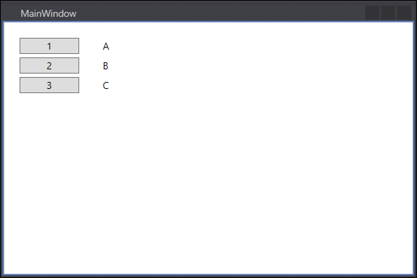
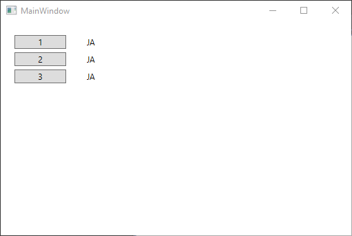
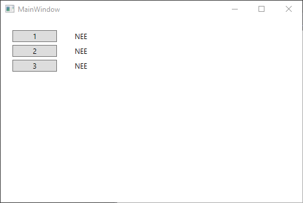
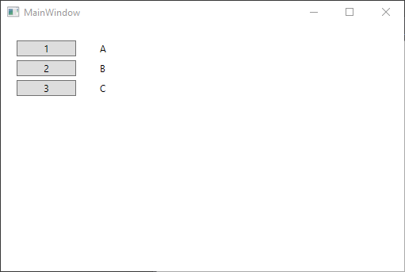

# Oefening 2.1: Inhoud van labels veranderen gebruikmakend van buttons

## XAML

```C#
<Window x:Class="DemoH2Testvraag1.MainWindow"
        xmlns="http://schemas.microsoft.com/winfx/2006/xaml/presentation"
        xmlns:x="http://schemas.microsoft.com/winfx/2006/xaml"
        xmlns:d="http://schemas.microsoft.com/expression/blend/2008"
        xmlns:mc="http://schemas.openxmlformats.org/markup-compatibility/2006"
        xmlns:local="clr-namespace:DemoH2Testvraag1"
        mc:Ignorable="d"
        Title="MainWindow" Height="350" Width="525">
    <Grid>
        <Button x:Name="button" Content="1" HorizontalAlignment="Left" Margin="20,20,0,0" VerticalAlignment="Top" Width="75" Click="button_Click"/>
        <Button x:Name="button1" Content="2" HorizontalAlignment="Left" Margin="20,45,0,0" VerticalAlignment="Top" Width="75" Click="button1_Click"/>
        <Button x:Name="button2" Content="3" HorizontalAlignment="Left" Margin="20,70,0,0" VerticalAlignment="Top" Width="75" Click="button2_Click"/>
        <Label x:Name="label" Content="A" HorizontalAlignment="Left" Margin="120,17,0,0" VerticalAlignment="Top"/>
        <Label x:Name="label1" Content="B" HorizontalAlignment="Left" Margin="120,42,0,0" VerticalAlignment="Top"/>
        <Label x:Name="label2" Content="C" HorizontalAlignment="Left" Margin="120,67,0,0" VerticalAlignment="Top"/>

    </Grid>
</Window>
```
#### Dit maakt hetgeen deze afbeelding weergeeft.



## Eventhandlers

```C#
using System;
using System.Collections.Generic;
using System.Linq;
using System.Text;
using System.Threading.Tasks;
using System.Windows;
using System.Windows.Controls;
using System.Windows.Data;
using System.Windows.Documents;
using System.Windows.Input;
using System.Windows.Media;
using System.Windows.Media.Imaging;
using System.Windows.Navigation;
using System.Windows.Shapes;

namespace DemoH2Testvraag1
{
    /// <summary>
    /// Interaction logic for MainWindow.xaml
    /// </summary>
    public partial class MainWindow : Window
    {
        public MainWindow()
        {
            InitializeComponent();
        }

        private void button_Click(object sender, RoutedEventArgs e)
        {
            label.Content = "JA";
            label1.Content = "JA";
            label2.Content = "JA";
        }

        private void button1_Click(object sender, RoutedEventArgs e)
        {
            label.Content = "NEE";
            label1.Content = "NEE";
            label2.Content = "NEE";
        }

        private void button2_Click(object sender, RoutedEventArgs e)
        {
            label.Content = "A";
            label1.Content = "B";
            label2.Content = "C";
        }
    }
}
```

#### Deze code zorgt voor het effect dat deze afbeeldingen weergeven indien:

##### De 1-knop wordt ingedrukt



##### De 2-knop wordt ingedrukt



##### De 3-knop wordt ingedrukt



