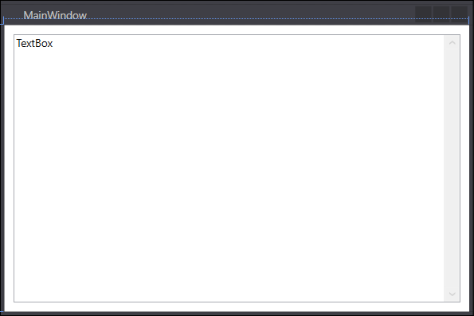
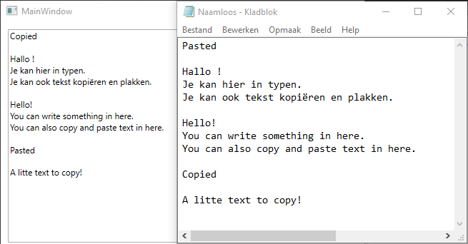

# Oefening 2.4: Eenvoudige Teksteditor

## XAML

```C#
<Window x:Class="WPFOef2._4TeskteditorMaken.MainWindow"
        xmlns="http://schemas.microsoft.com/winfx/2006/xaml/presentation"
        xmlns:x="http://schemas.microsoft.com/winfx/2006/xaml"
        xmlns:d="http://schemas.microsoft.com/expression/blend/2008"
        xmlns:mc="http://schemas.openxmlformats.org/markup-compatibility/2006"
        xmlns:local="clr-namespace:WPFOef2._4TeskteditorMaken"
        mc:Ignorable="d"
        Title="MainWindow" Height="350" Width="525">
    <Grid>
        <TextBox x:Name="textBox" HorizontalAlignment="Left" Height="299" Margin="10,10,0,0" Text="TextBox" VerticalAlignment="Top" Width="497" VerticalScrollBarVisibility="Visible" TextWrapping="Wrap" AcceptsReturn="True"/>

    </Grid>
</Window>
```
#### Dit maakt hetgeen deze afbeelding weergeeft.



## Eventhandlers

```C#
using System;
using System.Collections.Generic;
using System.Linq;
using System.Text;
using System.Threading.Tasks;
using System.Windows;
using System.Windows.Controls;
using System.Windows.Data;
using System.Windows.Documents;
using System.Windows.Input;
using System.Windows.Media;
using System.Windows.Media.Imaging;
using System.Windows.Navigation;
using System.Windows.Shapes;

namespace WPFOef2._4TeskteditorMaken
{
    /// <summary>
    /// Interaction logic for MainWindow.xaml
    /// </summary>
    public partial class MainWindow : Window
    {
        public MainWindow()
        {
            InitializeComponent();
        }
    }
}
```

#### Deze code zorgt voor het effect dat deze afbeeldingen weergeven indien:

##### Er tekst wordt ingegeven in het Mainwindow en in bijvoorbeeld Kladblok, gebruikmakend van 'Copy & Paste'


