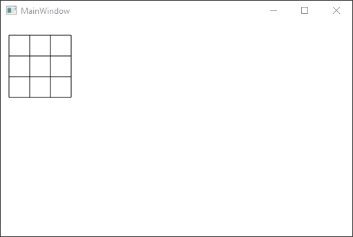

# Oefening 3.2: leeg boter-kaas-en-eieren spelbord
### Gebuikmakend van `Line`

## De XAML-code

```C#
<Window x:Class="Hoofdstuk3Oef2.MainWindow"
        xmlns="http://schemas.microsoft.com/winfx/2006/xaml/presentation"
        xmlns:x="http://schemas.microsoft.com/winfx/2006/xaml"
        xmlns:d="http://schemas.microsoft.com/expression/blend/2008"
        xmlns:mc="http://schemas.openxmlformats.org/markup-compatibility/2006"
        xmlns:local="clr-namespace:Hoofdstuk3Oef2"
        mc:Ignorable="d"
        Title="MainWindow" Height="350" Width="525">
    <Grid>
        <Canvas x:Name="paperCanvas" Background="White" HorizontalAlignment="Right" VerticalAlignment="Top" Width="517" Height="319"/>
    </Grid>
</Window>
```

## De Eventhandlers
```C#
using System;
using System.Collections.Generic;
using System.Linq;
using System.Text;
using System.Threading.Tasks;
using System.Windows;
using System.Windows.Controls;
using System.Windows.Data;
using System.Windows.Documents;
using System.Windows.Input;
using System.Windows.Media;
using System.Windows.Media.Imaging;
using System.Windows.Navigation;
using System.Windows.Shapes;

namespace Hoofdstuk3Oef2
{
    /// <summary>
    /// Interaction logic for MainWindow.xaml
    /// </summary>
    public partial class MainWindow : Window
    {
        public MainWindow()
        {
            InitializeComponent();
            DrawLine(20, 20, 20, 110);
            DrawLine(50, 20, 50, 110);
            DrawLine(80, 20, 80, 110);
            DrawLine(110, 20, 110, 110);
            DrawLine(20, 20, 110, 20);
            DrawLine(20, 50, 110, 50);
            DrawLine(20, 80, 110, 80);
            DrawLine(20, 110, 110, 110);
        }

        public void DrawLine(int x1, int y1, int x2, int y2)
        {
            Line Line1 = new Line();
            Line1.X1 = x1;
            Line1.Y1 = y1;
            Line1.X2 = x2;
            Line1.Y2 = y2;
            Line1.Stroke = new SolidColorBrush(Colors.Black);
            paperCanvas.Children.Add(Line1);
        }
    }
}
```
### Deze code zorgt voor het effect dat deze afbeelding weergeeft:

