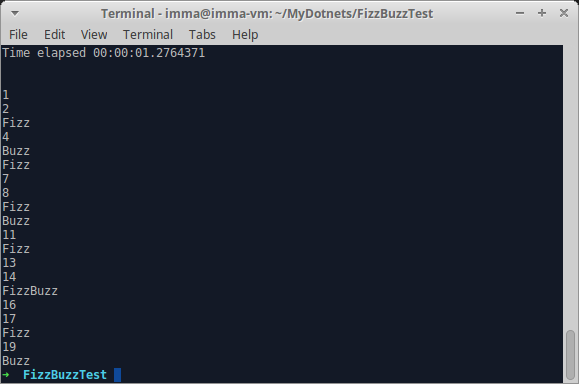

# Oefening: FizzBuzzTest

```
using System;

namespace ConsoleApplication
{
    public class Program
    {
        public static void Main(string[] args)
        {
            for(var i = 1; i <= 20; i++)
            {
                var x = i % 3;
                var y = i % 5;
                
                if(x == 0  && y == 0)
                {
                    Console.WriteLine("FizzBuzz");
                }

                else if(x == 0)
                {
                    Console.WriteLine("Fizz");
                }
                
                else if(y == 0)
                {
                    Console.WriteLine("Buzz");
                }
                
                else 
                {
                    Console.WriteLine(i);
                }
            }
        }
    }
}
```
#### Deze code zorgt voor het effect dat deze afbeelding weergeeft:


