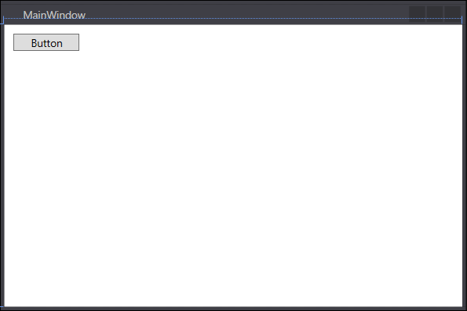
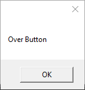

# Oefening 2.5: MouseEnter event

## XAML

```
<Window x:Class="WPFOef2._5MouseEnter.MainWindow"
        xmlns="http://schemas.microsoft.com/winfx/2006/xaml/presentation"
        xmlns:x="http://schemas.microsoft.com/winfx/2006/xaml"
        xmlns:d="http://schemas.microsoft.com/expression/blend/2008"
        xmlns:mc="http://schemas.openxmlformats.org/markup-compatibility/2006"
        xmlns:local="clr-namespace:WPFOef2._5MouseEnter"
        mc:Ignorable="d"
        Title="MainWindow" Height="350" Width="525">
    <Grid>
        <Button x:Name="button" Content="Button" HorizontalAlignment="Left" Margin="10,10,0,0" VerticalAlignment="Top" Width="75" MouseEnter="button_MouseEnter"/>

    </Grid>
</Window>
```
#### Dit maakt hetgeen deze afbeelding weergeeft.



## Eventhandlers

```
using System;
using System.Collections.Generic;
using System.Linq;
using System.Text;
using System.Threading.Tasks;
using System.Windows;
using System.Windows.Controls;
using System.Windows.Data;
using System.Windows.Documents;
using System.Windows.Input;
using System.Windows.Media;
using System.Windows.Media.Imaging;
using System.Windows.Navigation;
using System.Windows.Shapes;

namespace WPFOef2._5MouseEnter
{
    /// <summary>
    /// Interaction logic for MainWindow.xaml
    /// </summary>
    public partial class MainWindow : Window
    {
        public MainWindow()
        {
            InitializeComponent();
        }

        private void button_MouseEnter(object sender, MouseEventArgs e)
        {
            MessageBox.Show("Over Button");
        }
    }
}

```

#### Deze code zorgt voor het effect dat deze afbeeldingen weergeven indien:

##### men het programma start


##### men met de muis over de 'button' komt


