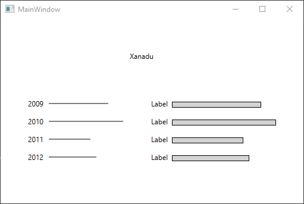

# Oefening 3.4: Regenval
### Gebruikmakend van `Line`, `Rectangle`

## De XAML-code
```C#
<Window x:Class="Hoofdstuk3Oef4.MainWindow"
        xmlns="http://schemas.microsoft.com/winfx/2006/xaml/presentation"
        xmlns:x="http://schemas.microsoft.com/winfx/2006/xaml"
        xmlns:d="http://schemas.microsoft.com/expression/blend/2008"
        xmlns:mc="http://schemas.openxmlformats.org/markup-compatibility/2006"
        xmlns:local="clr-namespace:Hoofdstuk3Oef4"
        mc:Ignorable="d"
        Title="MainWindow" Height="350" Width="525">
    <Grid>
        <Canvas x:Name="paperCanvasLijnen" HorizontalAlignment="Left" Height="148" Margin="31,120,0,0" VerticalAlignment="Top" Width="202">
            <Label x:Name="LJ1" Content="Label" Canvas.Left="10" Canvas.Top="10"/>
            <Label x:Name="LJ2" Content="Label" Canvas.Left="10" Canvas.Top="40"/>
            <Label x:Name="LJ3" Content="Label" Canvas.Left="10" Canvas.Top="70"/>
            <Label x:Name="LJ4" Content="Label" Canvas.Left="10" Canvas.Top="100"/>
        </Canvas>
        <Label x:Name="LandNaamLabel" Content="" HorizontalAlignment="Left" Margin="212,50,0,0" VerticalAlignment="Top"/>
        <Canvas x:Name="paperCanvasRechthoeken" HorizontalAlignment="Left" Height="148" Margin="238,120,0,0" VerticalAlignment="Top" Width="202">
            <Label x:Name="LJ5" Content="Label" Canvas.Left="10" Canvas.Top="10"/>
            <Label x:Name="LJ6" Content="Label" Canvas.Left="10" Canvas.Top="40"/>
            <Label x:Name="LJ7" Content="Label" Canvas.Left="10" Canvas.Top="70"/>
            <Label x:Name="LJ8" Content="Label" Canvas.Left="10" Canvas.Top="100"/>
        </Canvas>

    </Grid>
</Window>
```

## De Eventhandlers
```C#
using System;
using System.Collections.Generic;
using System.Linq;
using System.Text;
using System.Threading.Tasks;
using System.Windows;
using System.Windows.Controls;
using System.Windows.Data;
using System.Windows.Documents;
using System.Windows.Input;
using System.Windows.Media;
using System.Windows.Media.Imaging;
using System.Windows.Navigation;
using System.Windows.Shapes;

namespace Hoofdstuk3Oef4
{
    /// <summary>
    /// Interaction logic for MainWindow.xaml
    /// </summary>
    public partial class MainWindow : Window
    {
        public MainWindow()
        {
            InitializeComponent();
            GeefRegenval("Xanadu", 2009, 150, 2010, 175, 2011, 120, 2012, 130);
        }

        public void GeefRegenval(string land, int J1, int Rv1, int J2, int Rv2, int J3, int Rv3, int J4, int Rv4)
        {
            LandNaamLabel.Content = land;
            LJ1.Content = J1;
            DrawLine(Rv1, 23);
            DrawRectangle(Rv1, 20);
            LJ2.Content = J2;
            DrawLine(Rv2, 53);
            DrawRectangle(Rv2, 50);
            LJ3.Content = J3;
            DrawLine(Rv3, 83);
            DrawRectangle(Rv3, 80);
            LJ4.Content = J4;
            DrawLine(Rv4, 113);
            DrawRectangle(Rv4, 110);
        }

        public void DrawLine(int regenval, int y)
        {
            Line Line1 = new Line();
            Line1.X1 = 50;
            Line1.Y1 = y;
            Line1.X2 = regenval;
            Line1.Y2 = y;
            Line1.Stroke = new SolidColorBrush(Colors.Black);
            paperCanvasLijnen.Children.Add(Line1);
        }

        public void DrawRectangle(int regenval, int y)
        {
            Rectangle rect1 = new Rectangle();
            rect1.Width = regenval;
            rect1.Height = 10;
            rect1.Margin = new Thickness(50, y, 0, 0);
            rect1.Stroke = new SolidColorBrush(Colors.Black);
            rect1.Fill = new SolidColorBrush(Colors.LightGray);
            paperCanvasRechthoeken.Children.Add(rect1);
        }
    }
}
```
Deze code zorgt voor het effect dat deze afbeelding weergeeft:

