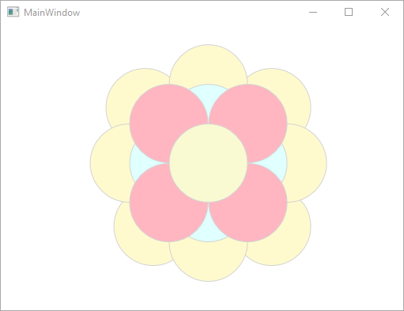

# Oefening 3.5: Roos van ellipsen
### Gebruikmakend van `ellipse` en `Colors.(kleur)` als parameter in een method

## De XAML-code
```C#
<Window x:Class="Hoofdstuk3Oef5.MainWindow"
        xmlns="http://schemas.microsoft.com/winfx/2006/xaml/presentation"
        xmlns:x="http://schemas.microsoft.com/winfx/2006/xaml"
        xmlns:d="http://schemas.microsoft.com/expression/blend/2008"
        xmlns:mc="http://schemas.openxmlformats.org/markup-compatibility/2006"
        xmlns:local="clr-namespace:Hoofdstuk3Oef5"
        mc:Ignorable="d"
        Title="MainWindow" Height="400" Width="525">
    <Grid>
        <Canvas x:Name="paperCanvas" Height="400" VerticalAlignment="Top" HorizontalAlignment="Left" Width="517"/>

    </Grid>
</Window>
```

De Eventhandlers
```C#
using System;
using System.Collections.Generic;
using System.Linq;
using System.Text;
using System.Threading.Tasks;
using System.Windows;
using System.Windows.Controls;
using System.Windows.Data;
using System.Windows.Documents;
using System.Windows.Input;
using System.Windows.Media;
using System.Windows.Media.Imaging;
using System.Windows.Navigation;
using System.Windows.Shapes;

namespace Hoofdstuk3Oef5
{
    /// <summary>
    /// Interaction logic for MainWindow.xaml
    /// </summary>
    public partial class MainWindow : Window
    {
        public MainWindow()
        {
            InitializeComponent();
            DrawRose();
        }

        public void DrawRose()
        {
            TekenBuitensteKring();
            TekenMiddelsteKring();
            TekenBinnensteKring();
            TekenMiddelsteCirkel();
        }

        public void DrawCircle(double w, double h, Color fill)
        {
            Ellipse c = new Ellipse();
            c.Width = 100;
            c.Height = 100;
            c.Margin = new Thickness(w, h, 0, 0);
            c.Stroke = new SolidColorBrush(Colors.LightGray);
            c.Fill = new SolidColorBrush(fill);
            paperCanvas.Children.Add(c);
        }

        public void TekenMiddelsteKring()
        {
            DrawCircle(162.5, 125, Colors.LightCyan);
            DrawCircle(262.5, 125, Colors.LightCyan);
            DrawCircle(212.5, 75, Colors.LightCyan);
            DrawCircle(212.5, 175, Colors.LightCyan);
        }

        public void TekenBinnensteKring()
        {
            DrawCircle(162.5, 75, Colors.LightPink);
            DrawCircle(162.5, 175, Colors.LightPink);
            DrawCircle(262.5, 75, Colors.LightPink);
            DrawCircle(262.5, 175, Colors.LightPink);
        }

        public void TekenMiddelsteCirkel()
        {
            DrawCircle(212.5, 125, Colors.LightGoldenrodYellow);
        }
        
        public void TekenBuitensteKring()
        {
            DrawCircle(132.5, 55, Colors.LemonChiffon);
            DrawCircle(292.5, 55, Colors.LemonChiffon);
            DrawCircle(142.5, 205, Colors.LemonChiffon);
            DrawCircle(292.5, 205, Colors.LemonChiffon);
            DrawCircle(112.5, 125, Colors.LemonChiffon);
            DrawCircle(312.5, 125, Colors.LemonChiffon);
            DrawCircle(212.5, 25, Colors.LemonChiffon);
            DrawCircle(212.5, 225, Colors.LemonChiffon);
        }
    }
}
```
### Deze code zorgt voor het effect dat deze afbeelding weergeeft:

